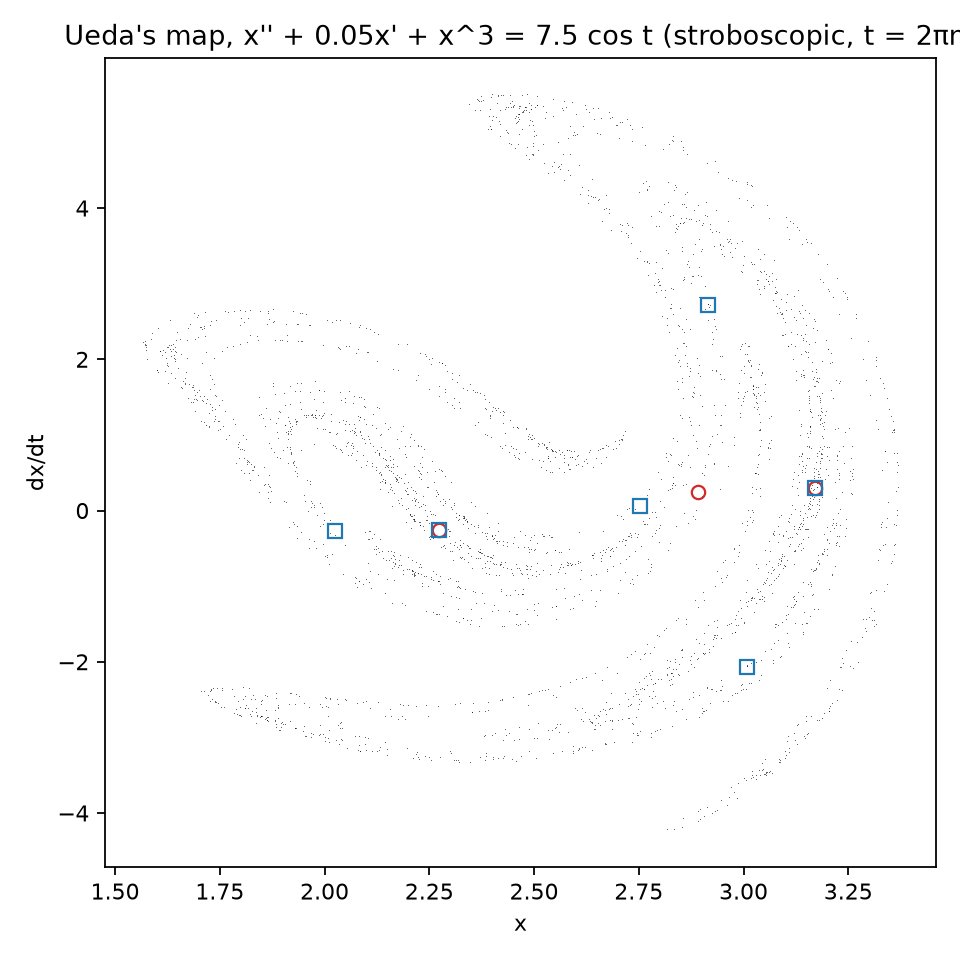
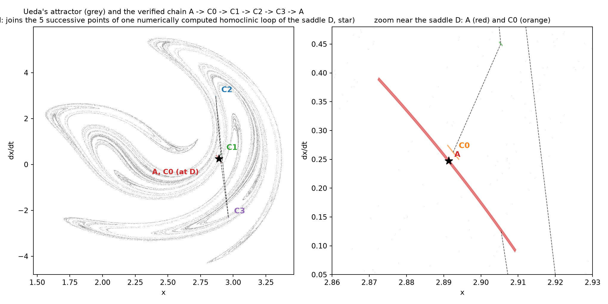

# Ueda's oscillator is chaotic: a computer-assisted proof

[](https://doi.org/10.5281/zenodo.23172757)

**Moki & Julio · 2026** · DOI [10.5281/zenodo.23172757](https://doi.org/10.5281/zenodo.23172757) (all versions; v1.0: 10.5281/zenodo.23172758)

Yoshisuke Ueda, at Kyoto University, made the periodically forced cubic oscillator

```
x'' + k x' + x^3 = B cos t
```

one of the founding examples of chaos [1, 2]: a damped spring with a cubic restoring force, pushed back and forth once
every 2π. Sampled once per push, its motion traces a folded, layered set, Ueda's chaotic attractor. Ueda's own account
names (k, B) = (0.05, 7.5) as the "representative" Ueda chaotic attractor [3], and that is the case proved here:

```
x'' + 0.05 x' + x^3 = 7.5 cos t
```

It has always been called chaotic on the strength of simulations: pictures, Lyapunov exponents and computed unstable
manifolds. As far as we could find, **its chaos has never been proved.**
- **The classical analytic route does not apply.** The unforced spring x'' + x^3 = 0 has no saddle point, so there
  is no homoclinic loop for Melnikov's method to perturb. The small-friction analytic results we found (see
  "Prior work") do not reach these parameters.
- **No computer-assisted proof covers it.** The computer-assisted chaos proofs we know of for forced oscillators treat
  other equations, such as the forced damped pendulum [6].

This repository proves it, with two independently written rigorous checkers.



## Theorem

Let P be the stroboscopic map of x'' + 0.05 x' + x^3 = 7.5 cos t: P(x, x') is the state at time t = 2π of the
solution that has state (x, x') at t = 0.

There are five pairwise disjoint h-sets A, C0, C1, C2, C3 in the (x, x') plane. Their exact definitions are in
[`proof/design_chain.txt`](proof/design_chain.txt): each is a box in its own chart, with its exit (stretching) and
entry directions. P satisfies the covering relations

```
A ⇒ A,   A ⇒ C0 ⇒ C1 ⇒ C2 ⇒ C3 ⇒ A.
```

A covering relation N ⇒ M means that P stretches N across M, in the topological sense of Zgliczyński and Gidea [8].
Consequently:

1. **Any itinerary is realised.** Write the motion as a sequence of two kinds of step:
   - **S:** stay one forcing period in A;
   - **L:** make one five-period excursion A → C0 → C1 → C2 → C3 and back to A.

   For **every** infinite sequence of S's and L's, chosen in any order, there is an exact solution of the equation
   that follows it.
2. **Infinitely many periodic orbits.** Every periodic such sequence is realised by a periodic orbit of P.
3. **Positive entropy.** P has a compact invariant set on which it is semi-conjugate to the subshift of finite type of
   this graph.
   - So the topological entropy of P is **at least ln ρ ≈ 0.2812 per forcing period**.
   - ρ ≈ 1.3247 is the *plastic number*, the real root of x³ = x + 1. It is the growth rate of the graph above,
     whose characteristic polynomial x⁵ − x⁴ − 1 factors as (x² − x + 1)(x³ − x − 1).

(P is a homeomorphism of the plane: solutions of this polynomial forced equation exist for all forward and backward
time. Entropy is in Bowen's sense, and h(P) ≥ h(P restricted to the invariant set).)

This is chaos in the sense of symbolic dynamics and positive topological entropy on an invariant set: the same kind of
statement that was proved first for the Lorenz and Rössler equations [9, 10].

**What is not claimed:**
- that almost every orbit is chaotic, or anything about Lyapunov exponents;
- that the visible attractor is this invariant set, or contains it;
- Ueda's hypothesis that the attractor is the closure of the unstable manifold of the saddle D [3];
- that D exists with the numerical coordinates and multipliers quoted below. The theorem only gives some fixed point
  inside A, namely the orbit with itinerary SSS…;
- that D has a homoclinic orbit, transverse or not. The loop that guided the design is numerical.

## How the proof was built and checked



**1. Guide (numerical, not part of the proof).**
- **The saddle.** Simulations show a saddle-type fixed point D ≈ (2.891363, 0.246965), with multipliers 13.003744 and
  0.056169. These agree with the values Ueda lists [3] to every printed digit. [^fp]
- **The loop.** A point q0 on D's unstable branch, close to D, lands on D's local stable branch after four periods
  (q0 → q1 → q2 → q3 → q4): numerically, a homoclinic loop.
- **Why the excursion takes five periods.** The excursion L starts in A, so it takes five periods: one to move from A
  out to C0 (which contains q0), then four more.

**2. Five thin sets** (the coloured boxes in the figure):
- **A** is a thin strip through D along its stable direction. It is drawn in a curved chart that straightens the
  stable manifold.
- **C0 to C3** are drawn around q0 to q3, each in a straight chart aligned with the local stretching direction.

**3. Each covering relation N ⇒ M is three inequalities.** For one application of P:
- **(E−)** P maps the left edge of N strictly beyond one side of M;
- **(E+)** P maps the right edge strictly beyond the other side;
- **(S)** the whole image of N stays strictly inside M's band in the contracting direction.

Together with the disjointness of the five sets, these are the hypotheses of the covering-relation theorem.

**Why every link is a single period.** A first design asked for the four-period map from a set at q0 straight back
to D, in one enclosure. It failed, because that map stretches by a factor of about 2,500 along the loop (and by about
2.86 × 10⁴ ≈ 13.0037⁴ near D). Splitting the loop into one-period links fixed it.

**4. Rigorous arithmetic.** Each inequality is checked with interval arithmetic and validated Taylor integration of
the ODE (the CAPD library [11]). Every set is covered by small pieces, and each piece's image is enclosed with
guaranteed error bounds. Pieces whose enclosure is not decisive are split until it is.

**The charts.** Every chart is a homeomorphism of the whole plane by construction:
- an affine chart is X = Q + uU + sS with det[U S] ≠ 0;
- the curved chart is X = Q + (u + p(s))U + sS, with the explicit inverse u = a − p(s), where (a, s) = [U S]⁻¹(X − Q).

This holds for any polynomial p, so the chart can never fold over itself. Both checkers compute det[U S] in interval
arithmetic and find it bounded away from zero (|det| between 0.19 and 0.37). The choice of p, of the set sizes and of
the splitting strategy can therefore only make a check fail, never pass falsely.

## Results

Two independent programs were run on the same design file:

- **Checker A** ([`proof/check_chain.cpp`](proof/check_chain.cpp)).
  - Writes the forcing as a rotating pair (c, s) = (cos t, sin t), which makes the system autonomous.
  - Represents sets with CAPD's Lohner "tripleton" sets.
  - Proves disjointness by chart-to-chart interval subdivision.
  - 644 enclosures, **12 s** on one core. **VERIFIED.**
  - Also verified at Taylor orders 10 and 14.
- **Checker B** ([`independent/`](independent/)).
  - Written independently from the mathematical specification [`independent/SPEC.md`](independent/SPEC.md) only,
    without access to checker A.
  - Keeps time explicit in a 2-D vector field and uses CAPD's "doubleton" sets.
  - Reads every decimal in the design file as an outward-rounded interval.
  - Proves disjointness by separating projections.
  - 205 enclosures, **1.4 s**. **VERIFIED.**
  - Its report is [`independent/REPORT_B.md`](independent/REPORT_B.md).

Smallest proven margin per link (checker B, in the target set's chart units; all strictly positive):

| link | exit, left edge (E−) | exit, right edge (E+) | band (S) |
|---|---|---|---|
| A ⇒ A | 1.79e-2 | 1.80e-2 | 1.41e-1 |
| A ⇒ C0 | 3.92e-3 | 3.48e-2 | 3.20e-3 |
| C0 ⇒ C1 | 1.85e-3 | 1.35e-3 | 2.00e-3 |
| C1 ⇒ C2 | 1.58e-3 | 1.58e-3 | 2.87e-4 |
| C2 ⇒ C3 | 4.79e-4 | 4.79e-4 | 1.39e-3 |
| C3 ⇒ A | 3.29e-3 | 3.28e-3 | 3.28e-2 |

**Controls**, all run by `reproduce.sh`:
- **Library semantics.** CAPD's interval comparisons mean *certainly* (`proof/controls/cmp_test.cpp`).
- **A known result.** `reproduce.sh` reruns CAPD's Rössler horseshoe example, which re-proves the result of [10].
- **Negative controls must fail, and do.**
  - Checker A rejects all five:
    - the last link with its orientation flipped;
    - a 10× narrower C3;
    - a 10× thinner band for C1;
    - the forcing amplitude changed to 7.0;
    - the forcing amplitude changed to 7.4.
  - Checker B rejects the two it runs: the flipped last link and amplitude 7.4.

## Reproduce

Requires Linux (or WSL), g++ ≥ 11, CMake and git. The proofs take seconds; building CAPD takes a few minutes.

```
bash reproduce.sh
```

What it does:
- builds CAPD 6.1 at the pinned commit `03dc5628203334b214bb7d9fd63788a175521005`;
- prints the SHA-256 of the proof inputs;
- compiles both checkers;
- runs every proof and every control.

It exits with status 0 and the line `REPRODUCE: ALL RESULTS AND CONTROLS AS STATED` only if every proof verifies and
every negative control is rejected. [`reproduce_full.log`](reproduce_full.log) is the complete output of our own
clean-room run: a fresh copy and a fresh CAPD clone, about 2 minutes in total. Local paths in that log are replaced
by `<repo>`.

[`design/`](design/) holds the non-rigorous Python scripts:
- `attractor.py` draws the attractor;
- `explore.py` finds the fixed points;
- `manifolds2.py` grows the unstable manifold;
- `design.py` and `design_chain.py` built the charts and sets;
- `fig_proof.py` draws the figure.

None of them is needed to check the proof.

## History

**Ueda's own chronology.** On **27 November 1961** Ueda saw irregular, "broken egg" oscillations on an analog computer
[3, 4]. That recording is of a **different** equation:
- the forced negative-resistance oscillator x'' − μ(1 − γx²)x' + x³ = B cos νt;
- with μ = 0.2, γ = 8, B = 0.35, ν = 1.02 [4].

**The 1978 picture.** Ueda's 1978 paper on the forced cubic oscillator [1] works out its chaotic attractor at
(k, B) = (0.1, 12). Ueda recounts that David Ruelle nicknamed his attractor the "Japanese attractor" [14].

**The case proved here.** (k, B) = (0.05, 7.5) is the case Ueda's 2023 account calls the "representative" Ueda
chaotic attractor [3]. Neither the 1961 broken-egg equation nor the (0.1, 12) case is covered by this repository.

## Prior work we checked

Searches on 2026-10-05 covered:
- arXiv, Crossref and the web;
- the publication lists of the CAPD authors and of Galias, Zgliczyński and Wilczak.

The search terms were Ueda's equation and the forced cubic (no-linear-term) Duffing equation, each combined with
horseshoe, computer-assisted, interval arithmetic, validated numerics, symbolic dynamics and rigorous.

What turned up:
- **Analytic results.**
  - Holmes's Melnikov-method horseshoes for the double-well equation x'' + δx' − βx + x³ = f cos ωt at small damping and
    forcing [5].
  - Stretching-along-paths results collected by Burra and Zanolin [12], including a chaos result for Ueda's model at
    sufficiently small friction, which does not reach k = 0.05, B = 7.5.
- **Computer-assisted results.**
  - A proof of chaos for the forced damped pendulum [6].
  - A proof of a homoclinic tangency (not chaos) for the forced pendulum and the Hénon map [7].
- **Non-rigorous studies of Ueda's oscillator,** such as an approximate Melnikov criterion [13].

We found no rigorous proof for Ueda's equation at these parameters. If you know of one, please open an issue and we
will credit it here.

## References

1. Y. Ueda, *IEEJ Trans. Fundamentals and Materials* 98(3) (1978) 167-173 (in Japanese), doi:10.1541/ieejfms1972.98.167.
2. Y. Ueda, "Randomly transitional phenomena in the system governed by Duffing's equation", *J. Stat. Phys.* 20 (1979) 181-196, doi:10.1007/BF01011512.
3. Y. Ueda, *Uncovering the Nature of Chaos* (2023), https://chaos.amp.i.kyoto-u.ac.jp/en/wp-content/uploads/2023/11/UNCyu.pdf
4. Y. Ueda, "At the very instant when the author came across an inexperienced behavior", conference lecture, Kharkov (2010), https://www.kpi.kharkov.ua/archive/Conferences/nonlinear%20dynamics/2010/AT%20THE%20VERY%20INSTANT%20WHEN%20THE%20AUTHOR%20CAME%20ACROSS%20AN%20INEXPERIENCED%20BEHAVIOR.pdf
5. P. Holmes, "A nonlinear oscillator with a strange attractor", *Phil. Trans. R. Soc. A* 292 (1979) 419-448, doi:10.1098/rsta.1979.0068.
6. B. Bánhelyi, T. Csendes, B. Garay, L. Hatvani, "A computer-assisted proof of Σ3-chaos in the forced damped pendulum equation", *SIAM J. Appl. Dyn. Syst.* 7 (2008) 843-867, doi:10.1137/070695599.
7. D. Wilczak, P. Zgliczyński, "Computer assisted proof of the existence of homoclinic tangency for the Hénon map and for the forced damped pendulum", *SIAM J. Appl. Dyn. Syst.* 8 (2009) 1632-1663, doi:10.1137/090759975.
8. P. Zgliczyński, M. Gidea, "Covering relations for multidimensional dynamical systems", *J. Differential Equations* 202 (2004) 32-58, doi:10.1016/j.jde.2004.03.013.
9. Z. Galias, P. Zgliczyński, "Computer assisted proof of chaos in the Lorenz equations", *Physica D* 115 (1998) 165-188, doi:10.1016/S0167-2789(97)00233-9.
10. P. Zgliczyński, "Computer assisted proof of chaos in the Rössler equations and in the Hénon map", *Nonlinearity* 10 (1997) 243-252, doi:10.1088/0951-7715/10/1/016.
11. T. Kapela, M. Mrozek, D. Wilczak, P. Zgliczyński, "CAPD::DynSys: a flexible C++ toolbox for rigorous numerical analysis of dynamical systems", *Commun. Nonlinear Sci. Numer. Simul.* 101 (2021) 105578, doi:10.1016/j.cnsns.2020.105578.
12. L. Burra, F. Zanolin, *The Duffing Equation: Periodic Solutions and Chaotic Dynamics*, Springer (2025), doi:10.1007/978-981-97-8301-4.
13. G. Litak, A. Syta, M. Borowiec, "Homoclinic transition to chaos in the Ueda oscillator with external forcing", arXiv:nlin/0610018 (2006).
14. Y. Ueda, "Strange attractors and the origin of chaos", in R. Abraham, Y. Ueda (eds.), *The Chaos Avant-Garde: Memories of the Early Days of Chaos Theory*, World Scientific (2001), doi:10.1142/9789812386472_0003.

[^fp]: Ueda [3] also lists two inversely unstable fixed points, ¹I ≈ (3.170688, 0.295115) and ²I ≈ (2.273854, −0.260323),
with multipliers −0.490535 and −1.488991. Our non-rigorous computation reproduces ²I and gives (3.170688, 0.295150) for
¹I, a difference of 3.5 × 10⁻⁵ in the second coordinate that we have not resolved. None of these points is used in
the proof.

## Licence and citation

- **Licences:** text, figures and data are CC BY 4.0 (`LICENSE`); code is MIT (`LICENSE-CODE`). CAPD is used under
  its own licence and is not redistributed.
- **Authorship:** built with AI assistance.
- **Citation:** see `CITATION.cff`. Cite as Moki & Julio (2026), *Ueda's oscillator is chaotic: a computer-assisted
  proof*, Zenodo, doi:10.5281/zenodo.23172757.
